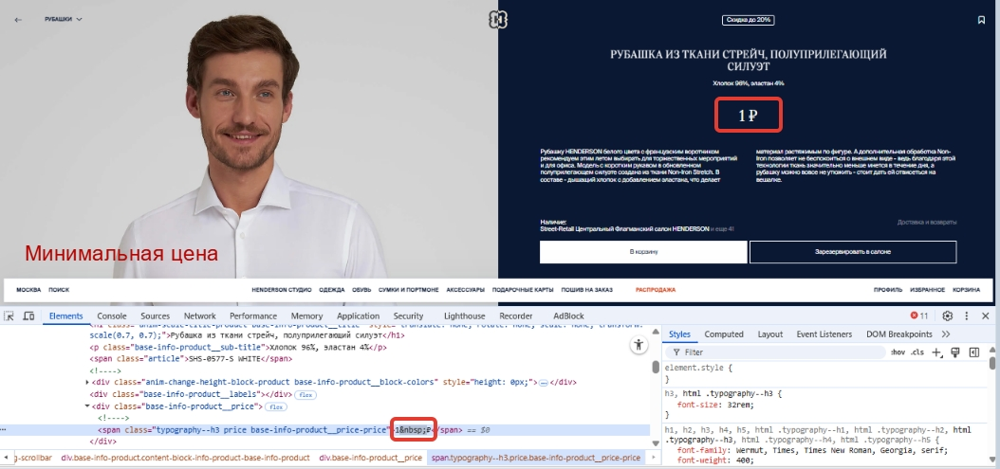
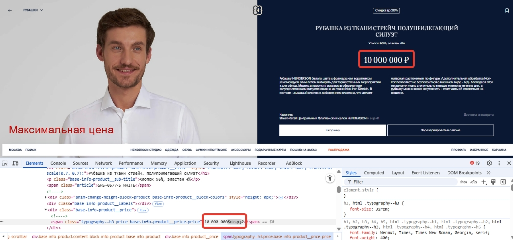

# Кейс: Тестирование вёрстки карточки товара при экстремальных значениях цен 🛒

### 📋 Контекст задачи (Условие)
Необходимо протестировать отображение вёрстки страницы карточки товара для двух экстремальных сценариев:
1. **Минимальная цена:** 1 рубль.
2. **Максимальная цена:** 10 000 000 рублей (согласно ТЗ).

**Ограничения:** На сайте нет товаров с такими ценами, бэкенд-разработчик находится в отпуске, тестовая база данных недоступна. 

**Цель:** Самостоятельно смоделировать нужные состояния интерфейса на фронтенде и проверить, не «развалится» ли вёрстка карточки товара при отображении длинных или аномально коротких чисел.

---

### 🛠 Стратегия решения задачи
Для выполнения задачи было принято решение использовать встроенные **Инструменты разработчика (Chrome DevTools)**. С помощью ручной подмены текстовых узлов в DOM-дереве страницы (вкладка *Elements*) были временно изменены коммерческие параметры товара локально в браузере. Это позволило сымитировать ответы от бэкенда без реального изменения данных на сервере.

---

### 🚀 Результаты тестирования

#### 1. Сценарий: Минимальная цена (1 рубль)
При изменении стоимости товара в DOM-дереве на значение `1` с неразрывным пробелом (`1&nbsp;`), на фронтенд вывелось значение **1 ₽**. Вёрстка элементов осталась стабильной, однако визуально цена выглядит аномально низкой для коммерческого продукта.

* **Используемый инструмент:** DevTools -> Редактирование текстового узла в теге `` внутри контейнера цены.
* **Доказательство (Скриншот):**

)

*(Примечание: Здесь используется имя твоей картинки минимальной цены, например devtools-bug.png)*

---

#### 2. Сценарий: Максимальная цена (10 000 000 рублей)
При замене текстового значения цены на максимальное граничное значение `10 000 000` вёрстка карточки товара... 
*(Здесь допиши одно предложение: например, "успешно адаптировалась под длинную строку, текст не вылез за границы блока" ИЛИ "сломалась, кнопка уехала вниз")*.

* **Используемый инструмент:** DevTools -> Вкладка Elements.
* **Доказательство (Скриншот):**

*(Примечание: Замени max-price-screenshot.png на имя картинки с максимальной ценой, когда загрузишь её в папку)*

---

### 💡 Вывод по задаче
Метод локальной подмены данных через DevTools полностью подтвердил свою эффективность для быстрого тестирования UI/UX ограничений. Вёрстка страницы в целом... *(допиши краткий итог: например, "готова к экстремальным нагрузкам" или "требует доработки в блоке максимальной цены")*.
