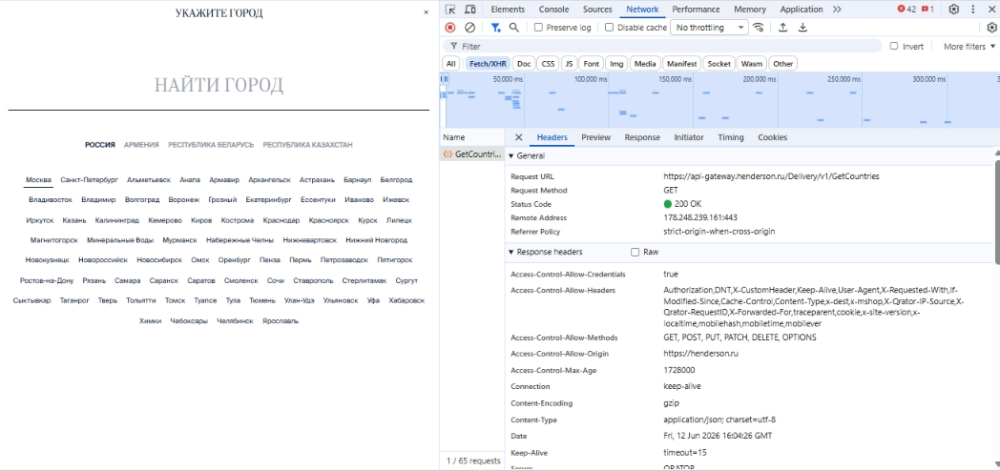
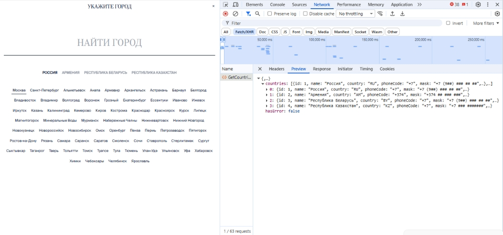

# Кейс: Анализ сетевого трафика и верификация API-запросов (Вкладка Network) 

### 📋 Контекст задачи (Условие)
Менеджеру проекта срочно потребовалось узнать, что содержится в Preview запроса, в котором мы получаем информацию о странах при загрузке главной страницы сайта Henderson. Документация пропала, а фронтенд-разработчик ушёл в отпуск в поход без связи.

**Известные параметры:** Информация уходит в GET-запросе по адресу, который содержит в себе `GetCountries`.
**Цель:** Изучить ответы и запросы при работе с сайтом, найти запрос с нужными параметрами, определить, как выглядит его Preview, и предоставить искомую информацию в виде скриншотов (вкладки Headers и Preview для полной демонстрации решения).

*Примечание: Задание выполнялось с выключенным VPN и блокировщиками рекламы.*

---

### 🛠 Стратегия и ход решения
Для локализации и перехвата данных использовались инструменты разработчика **Chrome DevTools (вкладка Network)**.

1. Были отключены VPN и блокировщики рекламы (AdBlock), чтобы исключить блокировку исходящих AJAX-запросов.
2. Открыта главная страница сайта `https://henderson.ru` с запущенным перехватом трафика (вкладка *Network* -> фильтр *Fetch/XHR*).
3. Через строку поиска сетевых запросов был установлен фильтр по ключевому слову **`GetCountries`**.
4. Был успешно перехвачен входящий **GET-запрос**, содержащий в адресе искомый параметр.
5. Проведен анализ вкладок **Headers** и **Preview** для изучения структуры ответа от бэкенда (формат JSON).

---

### 📊 Результаты исследования (Доказательства)

#### 1. Перехваченный HTTP-запрос (Вкладка Headers)
Запрос уходит методом `GET` на URL: `https://henderson.ru`. Сервер возвращает успешный статус ответа `200 OK`.

---

#### 2. Структура ответа от сервера (Вкладка Preview)
В теле ответа приходит JSON-объект, содержащий массив `countries`. Каждая страна представлена объектом со следующими параметрами: `id`, `name` (наименование), `country` (двухбуквенный код), `phonecode` (телефонный код страны) и `mask` (маска для ввода номера телефона). На данный момент бэкенд отдает список из 4 стран: Россия, Армения, Республика Беларусь, Республика Казахстан.

---

### 💡 Вывод
Продемонстрирован навык автономной работы с клиент-серверной архитектурой в условиях отсутствия актуальной документации (Swagger/Postman). Успешно извлечены технические данные из тела ответа бэкенда для передачи менеджеру проекта. Логика работы компонента выбора городов полностью прозрачна.
